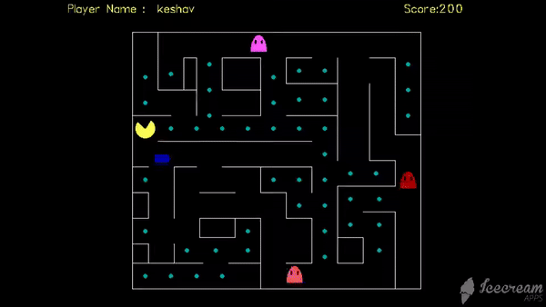

# PACMAN

##It is a simple PACMAN Game created using C++

`Clone the repo and run using Turbo C++`

**Works with other IDEs if they have the support for graphics.h**

**Limitations**

1. The speed of the Pacman is too slow.
2. The Pacman and the ghost flicker.
3. Ghost moves only when the player moves the Pacman. (**Can futher be upgraded by using multithreading and making the Pacman and the ghosts as 2 separate threads.**)

